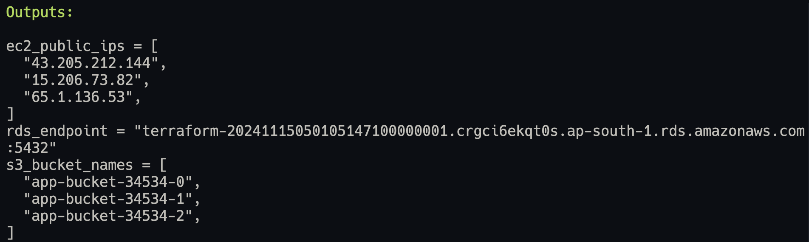
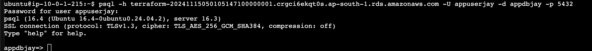
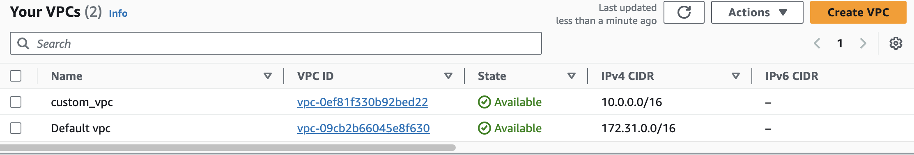
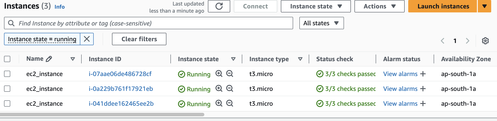
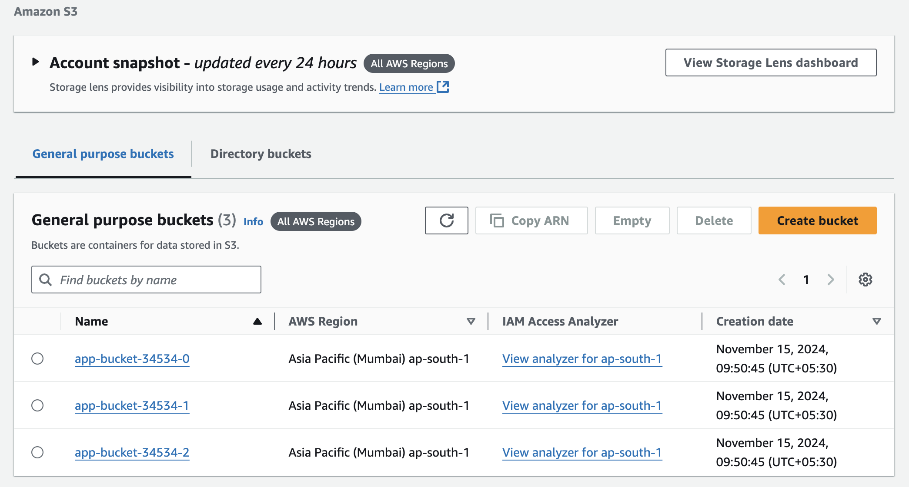
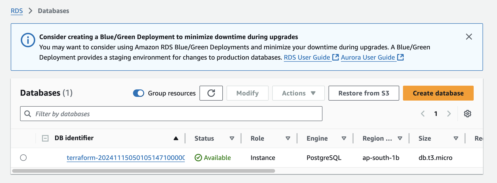

#AWS Scalable Web Application Infrastructure with Terraform

This repository provides a fully automated, scalable infrastructure deployment on AWS using Terraform. It includes configurations for EC2 instances, RDS, VPC setup, S3 storage, and networking. The infrastructure is designed to deploy a web application with three EC2 instances, an RDS PostgreSQL database, and necessary networking components.

## Architecture Overview

- **VPC Setup**: Creates a custom VPC with public and private subnets.
- **Compute Resources**: Deploys 3 EC2 instances running Ubuntu with Nginx installed.
- **Storage**: Creates 3 S3 buckets.
- **Database**: Deploys an RDS PostgreSQL instance.
- **Networking**: Configures security groups to allow HTTP (80), HTTPS (443), and SSH (22) access to EC2 instances. EC2 instances are configured to communicate with the RDS database over port 5432.

## Prerequisites

1. **Terraform**: Ensure Terraform is installed on your local machine. You can install it from the official Terraform website: https://www.terraform.io/downloads.html
2. **AWS Account**: An AWS account with sufficient permissions to create resources like VPCs, EC2 instances, RDS, and S3.
3. **AWS CLI**: Ensure the AWS CLI is installed and configured with your AWS credentials.

## File Structure

```
├── main.tf
├── variables.tf
├── outputs.tf
├── terraform.tfvars
├── modules
│   ├── ec2
│   │   ├── main.tf
│   │   ├── variables.tf
│   │   └── outputs.tf
│   ├── vpc
│   │   ├── main.tf
│   │   ├── variables.tf
│   │   └── outputs.tf
│   ├── s3
│   │   ├── main.tf
│   │   ├── variables.tf
│   │   └── outputs.tf
│   └── rds
│       ├── main.tf
│       ├── variables.tf
│       └── outputs.tf
├── user_data.sh
└── README.md

```

## Variables

All configurable parameters for this infrastructure are set in the terraform.tfvars file. You can adjust these variables as needed for your environment.

Example terraform.tfvars

```
# VPC Configuration
use_default_vpc = false
vpc_cidr_block = "10.0.0.0/16"
public_subnet_cidr = "10.0.1.0/24"
private_subnet_cidr = "10.0.2.0/24"

# EC2 Instance Configuration
instance_type = "t3.micro"
instance_count = 3
ami_id = "ami-0dee22c13ea7a9a67"
user_data_script = file("user_data.sh")

# S3 Bucket Configuration
s3_bucket_prefix = "app-bucket-34534"
s3_bucket_count = 3

# Database Configuration
db_name = "appdbjay"
db_username = "appuserjay"
db_password = "securepasswordjay"
db_instance_class = "db.t3.micro"
db_allocated_storage = 20
db_backup_retention = 7
multi_az = false
rds_engine_version = "16.3"
db_public_access = false

```

## Getting Started

1. Clone the Repository
   To begin, clone the repository to your local machine:

```
git clone https://github.com/jay75chauhan/aws-scalable-infrastructure-using-terraform
cd aws-scalable-infrastructure-using-terraform
```

2. Configure AWS Credentials
   Ensure that your AWS credentials are set up either through environment variables or the AWS CLI. You can configure them using:

```
aws configure
```

3. Configure Variables
   Create a terraform.tfvars file in the root directory of your project. This file contains the configuration values for your AWS infrastructure. Example:

```
use_default_vpc      = false
vpc_cidr_block       = "10.0.0.0/16"
public_subnet_cidr   = "10.0.1.0/24"
private_subnet_cidr  = "10.0.2.0/24"
instance_type        = "t3.micro"
instance_count       = 3
ami_id               = "ami-0dee22c13ea7a9a67"
s3_bucket_prefix     = "app-bucket-34534"
s3_bucket_count      = 3
db_name              = "appdbjay"
db_username          = "appuserjay"
db_password          = "securepasswordjay"
db_instance_class    = "db.t3.micro"
db_allocated_storage = 20
db_backup_retention  = 7
multi_az             = false
rds_engine_version   = "16.3"
db_public_access     = false
```

db_username and db_password: Used to configure your PostgreSQL database.

4. Initialize Terraform
   Before applying the Terraform configuration, initialize your Terraform environment to download the necessary providers:

```
terraform init
```

5. Apply the Configuration
   Once initialized, you can apply the Terraform configuration to provision the infrastructure:

```
terraform apply
```

Terraform will show a plan of the changes it will make. Type yes to approve the changes.

Output



6. Test the EC2 to RDS Connectivity
   Once logged into the EC2 instance, you can test the database connection using psql:

```
psql -h <rds-endpoint> -U <db-username> -d <db-name>
```

If successful, you'll be connected to the PostgreSQL database.

## Resources Created

The following AWS resources will be provisioned by Terraform:

- VPC with public and private subnets.
- 3 EC2 Instances running Ubuntu and Nginx.
- 3 S3 Buckets in the ap-south-1 region.
- RDS PostgreSQL instance with a private IP.

## Cleanup

To delete the resources created by Terraform, use the following command:

```
terraform destroy
```

This will prompt you to confirm that you want to delete all resources. Type yes to confirm.
